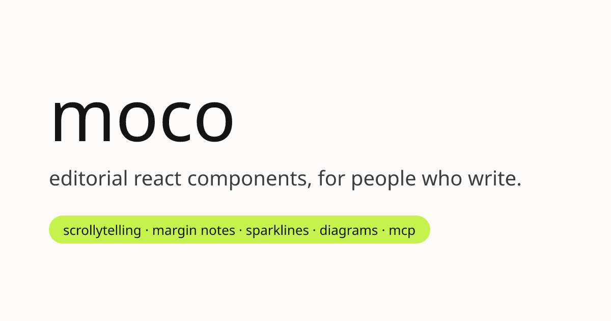

<p align="center">
  <a href="https://mocoui.site">
    
  </a>
</p>

<p align="center">
  <a href="https://mocoui.site"><b>Docs and live demos</b></a>
  ·
  <a href="https://mocoui.site/components">Components</a>
  ·
  <a href="https://mocoui.site/docs/mcp">MCP server</a>
  ·
  <a href="https://www.npmjs.com/package/moco-mcp">npm</a>
</p>

# moco

Editorial components for React. Built for technical essays and blogs: scrollytelling, margin notes, sparklines, before/after compares, animated numbers, block diagrams, and code walkthroughs.

moco is not a general UI kit. It covers the things longform writing needs and design systems usually skip. Every component ships with real typography, keyboard support, ARIA, and `prefers-reduced-motion` handling.

The code is copy-source. Components land in your repo as `.tsx` and `.css` files that you own and edit. There is no runtime package to install.

## Install

**Ask Claude.** Add the MCP server, then describe what you need.

```json
{ "mcpServers": { "moco": { "command": "npx", "args": ["-y", "moco-mcp"] } } }
```

Claude Code: `claude mcp add moco -- npx -y moco-mcp`

**Use the shadcn CLI.** moco is a standard shadcn-format registry, so this works with no extra tooling.

```sh
npx shadcn@latest add https://mocoui.site/r/compare.json
```

Register the namespace once in `components.json` to install by name. This also lets the official shadcn MCP browse moco.

```json
{ "registries": { "@moco": "https://mocoui.site/r/{name}.json" } }
```

```sh
npx shadcn@latest add @moco/compare
```

**Copy and paste.** Every component is a `.tsx` and `.css` pair, shown in full on its docs page.

## Setup

Install the `tokens` item once and import `tokens.css` in your root layout. Components style themselves from `--moco-*` variables, so overriding those retheme everything. Light and dark both ship by default, following `prefers-color-scheme` and forceable with `data-theme`.

Full guide: [mocoui.site/docs/installation](https://mocoui.site/docs/installation)

## What's in it

20 registry items. Reading UI (margin notes, term popovers, section rail, sticky reading header, command palette), figures and data (sparklines, count-up numbers, draggable numbers, block diagrams, figure plates, editorial tables, generative covers), narrative (scrollytelling stage, stepper, before/after compare, code walkthroughs), and the shared pieces (scroll hooks, view transitions, design tokens).

Browse them all at [mocoui.site/components](https://mocoui.site/components).

## Repo layout

- `registry/` holds the component sources, one directory per item with `.tsx`, `.css`, `meta.json`, and `demo.tsx`
- `apps/web` is the docs site, and serves the registry at `/r/*.json`
- `packages/mcp` is `moco-mcp`, the MCP server, which bundles the registry
- `scripts/build-registry.mjs` builds the registry and validates every item

## Develop

```sh
pnpm install
pnpm build:registry
pnpm dev        # docs site on localhost:3000
pnpm test       # registry validation and MCP smoke test
```

See [CONTRIBUTING.md](CONTRIBUTING.md) for how a registry item is structured and the rules components follow.

## License

MIT
